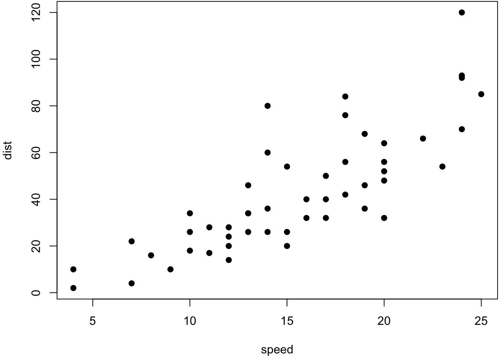

# Syntax

## Basic

You can make text italic by surrounding it with underscores or asterisks, e.g., _text_ or *text*. For bold text, use two underscores (__text__) or asterisks (**text**). Text surrounded by ~ will be converted to a subscript (e.g., H~2~SO~4~ renders H2SO4), and similarly, two carets (^) produce a superscript (e.g., Fe^2+^ renders Fe2+). To mark text as inline code, use a pair of backticks, e.g., `code`.3 Small caps can be produced by the HTML tag span, e.g., <span style="font-variant:small-caps;">Small Caps</span> renders Small Caps. Links are created using [text](link), e.g., [RStudio](https://www.rstudio.com). Footnotes are put inside the square brackets after a caret ^[], e.g., ^[This is a footnote.]. 

Blockquotes are possible

> "Rishi likes blockquotes a lot. If anyone thinks blockquotes 
are useless, they are incorrect and should rethink their priorities
and go do something else
>
> --- "Rishi Goutam"

```
This is a code block with no language
specified at all
```

    This is also a code block
    
## Headers

### H3

#### H4

##### You should really not use H5s...

## This header is not numbered {-}

## Math
$$e^{\pi i} + 1 = 0$$
$$X = \begin{bmatrix}1 & x_{1}\\
1 & x_{2}\\
1 & x_{3}
\end{bmatrix}$$

$$\begin{vmatrix}a & b\\
c & d
\end{vmatrix}=ad-bc$$

We can number an equation
\begin{equation}
  e^{\pi i} + 1 = 0
  (\#eq:epi)
\end{equation}

and refer to it \@ref(eq:epi)

## Special custom blocks

Bookdown provides some special handling for custom blocks, such as `theorem` and `example`. See [here](https://bookdown.org/yihui/bookdown/markdown-extensions-by-bookdown.html#theorems) for the full list

::: {.theorem #pyth name="Pythagorean theorem"}
For a right triangle, if $c$ denotes the length of the hypotenuse
and $a$ and $b$ denote the lengths of the other two sides, we have
$$a^2 + b^2 = c^2$$
:::

We can refer to a named `theorem`. Remember trig theorem \@ref(thm:pyth)

## Tables

We can have tables


Table: (\#tab:table-single)A table of the first 10 rows of the mtcars data.

|                  |  mpg| cyl|  disp|  hp| drat|    wt|  qsec| vs|
|:-----------------|----:|---:|-----:|---:|----:|-----:|-----:|--:|
|Mazda RX4         | 21.0|   6| 160.0| 110| 3.90| 2.620| 16.46|  0|
|Mazda RX4 Wag     | 21.0|   6| 160.0| 110| 3.90| 2.875| 17.02|  0|
|Datsun 710        | 22.8|   4| 108.0|  93| 3.85| 2.320| 18.61|  1|
|Hornet 4 Drive    | 21.4|   6| 258.0| 110| 3.08| 3.215| 19.44|  1|
|Hornet Sportabout | 18.7|   8| 360.0| 175| 3.15| 3.440| 17.02|  0|
|Valiant           | 18.1|   6| 225.0| 105| 2.76| 3.460| 20.22|  1|
|Duster 360        | 14.3|   8| 360.0| 245| 3.21| 3.570| 15.84|  0|
|Merc 240D         | 24.4|   4| 146.7|  62| 3.69| 3.190| 20.00|  1|
|Merc 230          | 22.8|   4| 140.8|  95| 3.92| 3.150| 22.90|  1|
|Merc 280          | 19.2|   6| 167.6| 123| 3.92| 3.440| 18.30|  1|


<table class="kable_wrapper">
<caption>(\#tab:iris)A Tale of Two Tables.</caption>
<tbody>
  <tr>
   <td> 

| Sepal.Length| Sepal.Width|
|------------:|-----------:|
|          5.1|         3.5|
|          4.9|         3.0|
|          4.7|         3.2|

 </td>
   <td> 

|                  |  mpg| cyl| disp|
|:-----------------|----:|---:|----:|
|Mazda RX4         | 21.0|   6|  160|
|Mazda RX4 Wag     | 21.0|   6|  160|
|Datsun 710        | 22.8|   4|  108|
|Hornet 4 Drive    | 21.4|   6|  258|
|Hornet Sportabout | 18.7|   8|  360|

 </td>
  </tr>
</tbody>
</table>


## Figures {#figures}


```r
par(mar = c(4, 4, .1, .1))
plot(cars, pch = 19)
```

<div class="figure">

<p class="caption">(\#fig:cars-plot)A figure example with a relative width 70\%.</p>
</div>


```r
knitr::include_graphics(rep('memoji.png'))
```

<div class="figure">

<p class="caption">(\#fig:memoji)Memoji of Rishi Goutam</p>
</div>


## HTML Widgets

See [htmlwidgets](https://www.htmlwidgets.org/)

We can also use JavaScript libraries for rich data visualizations. Install the below for outputting to non-HTML files.

```
install.packages("webshot")
webshot::install_phantomjs()
```

We use the DT package to show the iris dataset:


```r
DT::datatable(iris)
```

<div class="figure">

```{=html}
<div id="htmlwidget-06bd2abe2a50f159e3b3" style="width:100%;height:auto;" class="datatables html-widget"></div>
<script type="application/json" data-for="htmlwidget-06bd2abe2a50f159e3b3">{"x":{"filter":"none","vertical":false,"data":[["1","2","3","4","5","6","7","8","9","10","11","12","13","14","15","16","17","18","19","20","21","22","23","24","25","26","27","28","29","30","31","32","33","34","35","36","37","38","39","40","41","42","43","44","45","46","47","48","49","50","51","52","53","54","55","56","57","58","59","60","61","62","63","64","65","66","67","68","69","70","71","72","73","74","75","76","77","78","79","80","81","82","83","84","85","86","87","88","89","90","91","92","93","94","95","96","97","98","99","100","101","102","103","104","105","106","107","108","109","110","111","112","113","114","115","116","117","118","119","120","121","122","123","124","125","126","127","128","129","130","131","132","133","134","135","136","137","138","139","140","141","142","143","144","145","146","147","148","149","150"],[5.1,4.9,4.7,4.6,5,5.4,4.6,5,4.4,4.9,5.4,4.8,4.8,4.3,5.8,5.7,5.4,5.1,5.7,5.1,5.4,5.1,4.6,5.1,4.8,5,5,5.2,5.2,4.7,4.8,5.4,5.2,5.5,4.9,5,5.5,4.9,4.4,5.1,5,4.5,4.4,5,5.1,4.8,5.1,4.6,5.3,5,7,6.4,6.9,5.5,6.5,5.7,6.3,4.9,6.6,5.2,5,5.9,6,6.1,5.6,6.7,5.6,5.8,6.2,5.6,5.9,6.1,6.3,6.1,6.4,6.6,6.8,6.7,6,5.7,5.5,5.5,5.8,6,5.4,6,6.7,6.3,5.6,5.5,5.5,6.1,5.8,5,5.6,5.7,5.7,6.2,5.1,5.7,6.3,5.8,7.1,6.3,6.5,7.6,4.9,7.3,6.7,7.2,6.5,6.4,6.8,5.7,5.8,6.4,6.5,7.7,7.7,6,6.9,5.6,7.7,6.3,6.7,7.2,6.2,6.1,6.4,7.2,7.4,7.9,6.4,6.3,6.1,7.7,6.3,6.4,6,6.9,6.7,6.9,5.8,6.8,6.7,6.7,6.3,6.5,6.2,5.9],[3.5,3,3.2,3.1,3.6,3.9,3.4,3.4,2.9,3.1,3.7,3.4,3,3,4,4.4,3.9,3.5,3.8,3.8,3.4,3.7,3.6,3.3,3.4,3,3.4,3.5,3.4,3.2,3.1,3.4,4.1,4.2,3.1,3.2,3.5,3.6,3,3.4,3.5,2.3,3.2,3.5,3.8,3,3.8,3.2,3.7,3.3,3.2,3.2,3.1,2.3,2.8,2.8,3.3,2.4,2.9,2.7,2,3,2.2,2.9,2.9,3.1,3,2.7,2.2,2.5,3.2,2.8,2.5,2.8,2.9,3,2.8,3,2.9,2.6,2.4,2.4,2.7,2.7,3,3.4,3.1,2.3,3,2.5,2.6,3,2.6,2.3,2.7,3,2.9,2.9,2.5,2.8,3.3,2.7,3,2.9,3,3,2.5,2.9,2.5,3.6,3.2,2.7,3,2.5,2.8,3.2,3,3.8,2.6,2.2,3.2,2.8,2.8,2.7,3.3,3.2,2.8,3,2.8,3,2.8,3.8,2.8,2.8,2.6,3,3.4,3.1,3,3.1,3.1,3.1,2.7,3.2,3.3,3,2.5,3,3.4,3],[1.4,1.4,1.3,1.5,1.4,1.7,1.4,1.5,1.4,1.5,1.5,1.6,1.4,1.1,1.2,1.5,1.3,1.4,1.7,1.5,1.7,1.5,1,1.7,1.9,1.6,1.6,1.5,1.4,1.6,1.6,1.5,1.5,1.4,1.5,1.2,1.3,1.4,1.3,1.5,1.3,1.3,1.3,1.6,1.9,1.4,1.6,1.4,1.5,1.4,4.7,4.5,4.9,4,4.6,4.5,4.7,3.3,4.6,3.9,3.5,4.2,4,4.7,3.6,4.4,4.5,4.1,4.5,3.9,4.8,4,4.9,4.7,4.3,4.4,4.8,5,4.5,3.5,3.8,3.7,3.9,5.1,4.5,4.5,4.7,4.4,4.1,4,4.4,4.6,4,3.3,4.2,4.2,4.2,4.3,3,4.1,6,5.1,5.9,5.6,5.8,6.6,4.5,6.3,5.8,6.1,5.1,5.3,5.5,5,5.1,5.3,5.5,6.7,6.9,5,5.7,4.9,6.7,4.9,5.7,6,4.8,4.9,5.6,5.8,6.1,6.4,5.6,5.1,5.6,6.1,5.6,5.5,4.8,5.4,5.6,5.1,5.1,5.9,5.7,5.2,5,5.2,5.4,5.1],[0.2,0.2,0.2,0.2,0.2,0.4,0.3,0.2,0.2,0.1,0.2,0.2,0.1,0.1,0.2,0.4,0.4,0.3,0.3,0.3,0.2,0.4,0.2,0.5,0.2,0.2,0.4,0.2,0.2,0.2,0.2,0.4,0.1,0.2,0.2,0.2,0.2,0.1,0.2,0.2,0.3,0.3,0.2,0.6,0.4,0.3,0.2,0.2,0.2,0.2,1.4,1.5,1.5,1.3,1.5,1.3,1.6,1,1.3,1.4,1,1.5,1,1.4,1.3,1.4,1.5,1,1.5,1.1,1.8,1.3,1.5,1.2,1.3,1.4,1.4,1.7,1.5,1,1.1,1,1.2,1.6,1.5,1.6,1.5,1.3,1.3,1.3,1.2,1.4,1.2,1,1.3,1.2,1.3,1.3,1.1,1.3,2.5,1.9,2.1,1.8,2.2,2.1,1.7,1.8,1.8,2.5,2,1.9,2.1,2,2.4,2.3,1.8,2.2,2.3,1.5,2.3,2,2,1.8,2.1,1.8,1.8,1.8,2.1,1.6,1.9,2,2.2,1.5,1.4,2.3,2.4,1.8,1.8,2.1,2.4,2.3,1.9,2.3,2.5,2.3,1.9,2,2.3,1.8],["setosa","setosa","setosa","setosa","setosa","setosa","setosa","setosa","setosa","setosa","setosa","setosa","setosa","setosa","setosa","setosa","setosa","setosa","setosa","setosa","setosa","setosa","setosa","setosa","setosa","setosa","setosa","setosa","setosa","setosa","setosa","setosa","setosa","setosa","setosa","setosa","setosa","setosa","setosa","setosa","setosa","setosa","setosa","setosa","setosa","setosa","setosa","setosa","setosa","setosa","versicolor","versicolor","versicolor","versicolor","versicolor","versicolor","versicolor","versicolor","versicolor","versicolor","versicolor","versicolor","versicolor","versicolor","versicolor","versicolor","versicolor","versicolor","versicolor","versicolor","versicolor","versicolor","versicolor","versicolor","versicolor","versicolor","versicolor","versicolor","versicolor","versicolor","versicolor","versicolor","versicolor","versicolor","versicolor","versicolor","versicolor","versicolor","versicolor","versicolor","versicolor","versicolor","versicolor","versicolor","versicolor","versicolor","versicolor","versicolor","versicolor","versicolor","virginica","virginica","virginica","virginica","virginica","virginica","virginica","virginica","virginica","virginica","virginica","virginica","virginica","virginica","virginica","virginica","virginica","virginica","virginica","virginica","virginica","virginica","virginica","virginica","virginica","virginica","virginica","virginica","virginica","virginica","virginica","virginica","virginica","virginica","virginica","virginica","virginica","virginica","virginica","virginica","virginica","virginica","virginica","virginica","virginica","virginica","virginica","virginica","virginica","virginica"]],"container":"<table class=\"display\">\n  <thead>\n    <tr>\n      <th> <\/th>\n      <th>Sepal.Length<\/th>\n      <th>Sepal.Width<\/th>\n      <th>Petal.Length<\/th>\n      <th>Petal.Width<\/th>\n      <th>Species<\/th>\n    <\/tr>\n  <\/thead>\n<\/table>","options":{"columnDefs":[{"className":"dt-right","targets":[1,2,3,4]},{"orderable":false,"targets":0}],"order":[],"autoWidth":false,"orderClasses":false}},"evals":[],"jsHooks":[]}</script>
```

<p class="caption">(\#fig:DT-demo)A table widget rendered via the DT package.</p>
</div>

